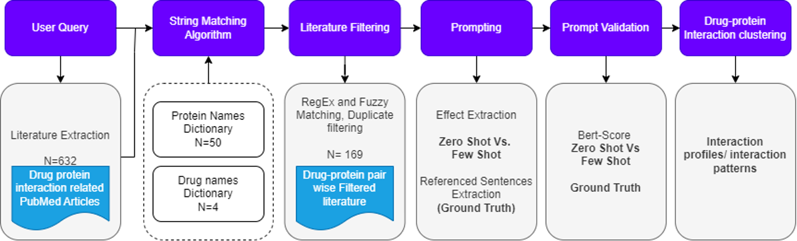

# LLM-Enhanced Drug-Protein Interaction Analysis to Aid Computational Chemistry

### Project Overview
This repository contains the scripts and data files used in the project, **Clustering Effects of Folic Acid Drug Derivatives on a Given Set of Proteins using LLMs for Drug Repurposing**. The project leverages Large Language Models (LLMs) to explore the intricate drug-protein interactions of folic acid derivatives and their potential applications in drug repurposing. One major focus of this research is to investigate the clustering of these interactions based on their biological effects, such as upregulation, downregulation, or neutral impact on protein targets.

Through these analyses, we aim to provide a more structured and in-depth understanding of how folic acid derivatives influence key metabolic pathways and cellular processes. Additionally, the results may provide insight into new therapeutic applications for these derivatives beyond their original intended use.

## Key Findings

1. **Clustering Drug-Protein Interactions:**  
   Our findings highlighted the regulatory effects of folic acid derivatives, revealing diverse interactions with protein targets. The clustering approach has helped uncover patterns of influence that could be pivotal for identifying potential drug repurposing opportunities.

2. **Incorporation of Evidence Hierarchy:**  
   Confidence scores were assigned to each drug-protein interaction based on the quality of the supporting evidence, refining the clustering results to prioritize high-confidence interactions.

3. **Enhanced Visualizations:**  
   Gradient-based visualizations, including heatmaps, were developed to better represent the clustered data, allowing for easier identification of key trends and anomalies.

4. **Prompting Technique Comparison:**  
   A comparison between zero-shot and few-shot prompting with LLMs revealed that few-shot prompting generally led to more accurate and contextually relevant extractions of interaction data.

5. **Challenges and Limitations:**  
   While successful, the study faced some limitations, particularly in data filtering verification and prompt validation, underscoring the need for further refinement in handling complex biomedical literature.

## Repository Structure

- **Folic Acid Metabolism PMC Analysis/**: Contains all input datasets related to drug-protein interaction analysis.
- **filtered_papers_final/**: contains the latest version of filtered papers.
- **Prompt/**: Contains scripts, each corresponding to one step of the pipeline (see the process pipeline below).
- **csv files**: Final CSVs with prompt results.
- **old versions/**: Contains data related to previous versions of literature filtering
- **old extracted relations/**: Previous versions of the prompting results

### Pipeline Overview

The project pipeline is divided into 7 steps, each represented by a script in the `Prompt/` folder. The steps guide the user through the process, from raw data input to the final clustered results.

1. **Step 1:** Data Collection and Preprocessing
   - Extract relevant drug-protein interaction literature through user queries.
     
2. - **Step 2:** String Matching Algorithm and Literature Filtering (`./Prompt/filtering.py`)
   - Filter extracted literature based on relevant drug-protein pairs.

3. **Step 3:** Prompting Techniques Comparison (`./Prompt/prompting.py`)
   - Compares zero-shot and few-shot prompting techniques in extracting drug-protein interaction data.
     
4. **Step 4:** Evidence Hierarchy Incorporation (`./Prompt/prompting.py`)
   - Integrates confidence scores to refine the classification based on supporting evidence from the literature.

5. **Step 5:** Prompting Techniques validation (`./Prompt/BertScore.ipynb`)
   - Validates the prompting results using Bertscore against ground truth

4. **Step 4:** Heatmap clustering and Visualization (`.Prompt/Heatmapclustering.ipynb`)
   - Generates gradient-based visualizations (heatmaps) to represent the strength and confidence of interactions.
   - Performs an initial clustering of the interaction data based on biological effects (upregulation, downregulation, neutral).

7. **Step 6:** Final Analysis (`.Prompt/hm2.py`)
   - Combines all findings from clustering and exports the final results in CSV format for further analysis and interpretation.

## Getting Started

### Prerequisites

- Python 3.x
- Libraries: `pandas`, `scikit-learn`, `matplotlib`, `seaborn`, `openai` (or other LLM frameworks)
  

